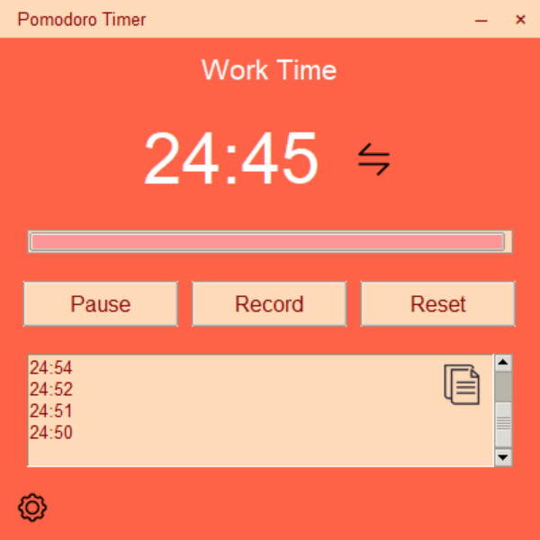
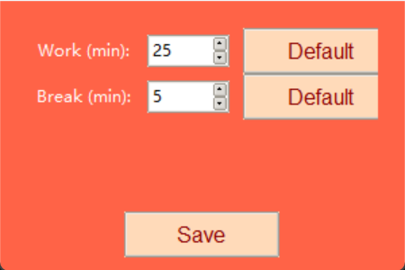

# 🍅 Pomodoro Timer 番茄计时器

## 简介 / Overview

A minimalist Pomodoro Timer built with Python & Tkinter to boost focus. Features a fixed draggable window, adjustable work/break times, time logging, and interactive icons for copying and switching sessions.
简洁的番茄计时器，使用 Python 和 Tkinter 打造，提升专注力。支持固定可拖动窗口，可调工作/休息时间，时间记录，以及复制与切换模式图标。

---

## 功能展示 / Features

| 功能                    | English / 中文                                                                                                   |
|  --------------------- | -------------------------------------------------------------------------------------------------------------- |
|Customizable Pomodoro | Default 25min work, 5min break, adjustable via Settings.<br>可调番茄工作法：默认 25 分钟工作，5 分钟休息，可在设置中调整。                 |
|Fixed & Draggable UI  | 400x400, non-resizable, custom title bar, supports minimize/restore.<br>固定且可拖动界面：400x400，不可缩放，自定义标题栏，支持最小化/恢复。 |
|  Switch Mode           | Click the switch icon beside the timer to toggle sessions.<br>切换模式：点击计时器旁 switch 图标切换工作/休息模式。                  |
| Settings Panel        | Adjust work/break durations with default buttons.<br>设置面板：调整工作/休息时间，每个选项提供默认按钮恢复默认值。                           |
|  Time Log              | Record timer values in a scrollable panel.<br>时间记录：可滚动查看并记录计时。                                                 |
| Copy Icon             | One-click copy of all recorded times.<br>复制图标：一键复制所有记录。                                                        |

---

## 界面截图 / Screenshots
<!-- 主界面 / Main Window -->
<p align="center">
  <b>主界面 / Main Window</b><br>
  
</p>

<!-- 设置面板 / Settings Panel -->
<p align="center">
  <b>设置面板 / Settings Panel</b><br>
  
</p>


---

## 安装 / Installation

```bash
git clone https://github.com/BlairCode/PomodoroTimer.git
pip install Pillow pyperclip pystray
```

Add icons (`copy.png`, `switch.png`, `setting.png`) to the project folder.
将必要图标放入项目文件夹。

---

## 使用 / Usage

1. **Start/Pause**: Toggle timer with "Start".
   **开始/暂停**：点击“Start”切换计时。
2. **Record**: Save current timer value with "Record".
   **记录**：点击“Record”保存当前计时。
3. **Copy**: Click top-right copy icon to copy logs.
   **复制**：点击右上复制图标复制记录。
4. **Switch Mode**: Click switch icon beside timer to toggle sessions.
   **切换模式**：点击计时器旁 switch 图标切换工作/休息模式。
5. **Settings**: Click settings icon (bottom-left) to adjust durations, use default buttons to reset.
   **设置面板**：点击左下设置图标调整时间，可用默认按钮恢复默认值。
6. **Reset**: Restart current session.
   **重置**：点击“Reset”重置当前计时。
7. **Minimize/Restore**: Minimize hides window, restore via system tray/floating button.
   **最小化/恢复**：最小化隐藏窗口，可通过托盘/浮窗恢复。

---

## 依赖 / Dependencies

* Python 3.9+
* Tkinter
* Pillow (`pip install Pillow`)
* pyperclip (`pip install pyperclip`)
* pystray (`pip install pystray`) — for system tray support
